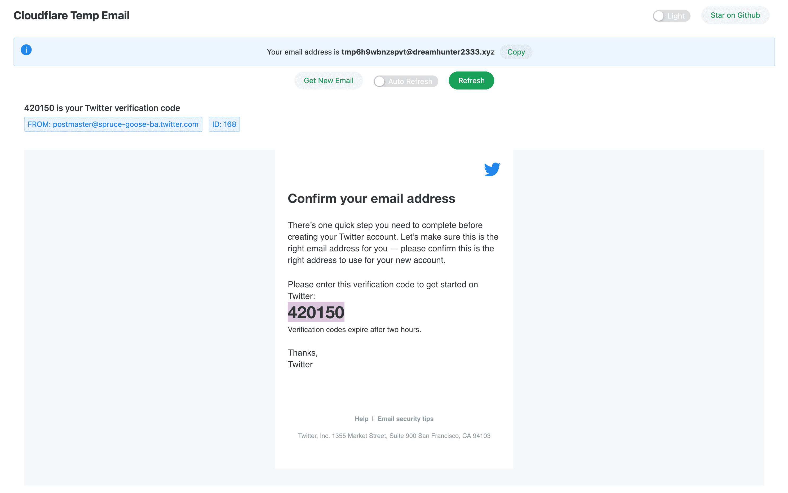
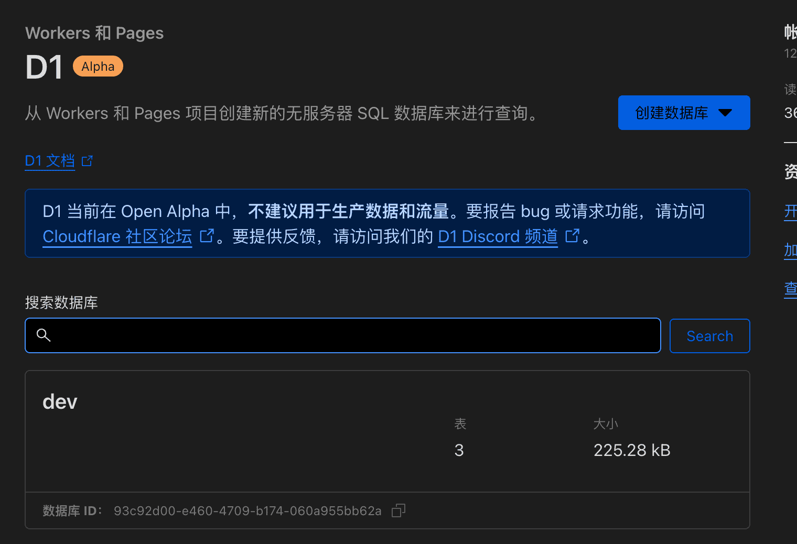
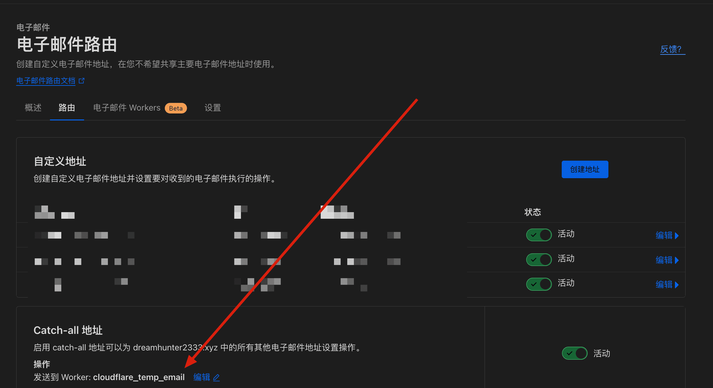

# cloudflare temp email

利用 Cloudflare Workers 创建临时邮箱

- 使用 Cloudflare Pages 部署前端
- 使用 Cloudflare Workers 部署后端
- email 转发使用 Cloudflare Email Route
- Cloudflare D1 作为数据库。

[在线演示](https://temp-email.dreamhunter2333.xyz/)

This is a temporary email service that uses Cloudflare Workers to create a temporary email address and view the received email in web browser.

[Live Demo](https://temp-email.dreamhunter2333.xyz/)



## Deploy

[Install/Update Wrangler](https://developers.cloudflare.com/workers/wrangler/install-and-update/)

## DB - Cloudflare D1

```bash
# create a database, and copy the output to wrangler.toml in the next step
wrangler d1 create dev
wrangler d1 execute dev --file=db/schema.sql
```



### Backend - Cloudflare workers

```bash
cd worker
npm install
# copy wrangler.toml.template to wrangler.toml
# and add your d1 config and these config
# PREFIX = "tmp" - the email create will be like tmp<xxxxx>@DOMAIN
# DOMAIN = "xxx.xxx" - you domain name
# JWT_SECRET = "xxx"
# BLACK_LIST = ""
cp wrangler.toml.template wrangler.toml
# deploy
wrangler deploy
```

you can find and test the worker's url in the  workers dashboard


enable email route and config email forward catch-all to the worker



### Frontend - Cloudflare pages

```bash
cd frontend
pnpm install
# add .env.local and modify VITE_API_BASE to your worker's url
cp .env.example .env.local
pnpm build --emptyOutDir
cd ..
wrangler pages deploy dist --branch production
```


